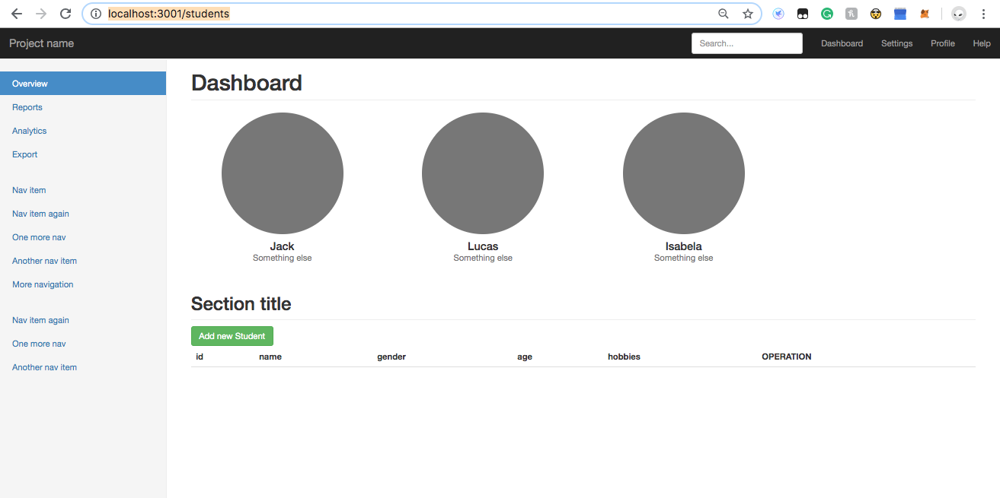
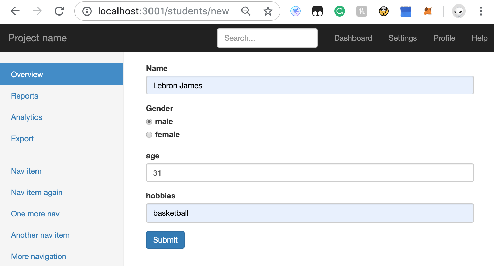
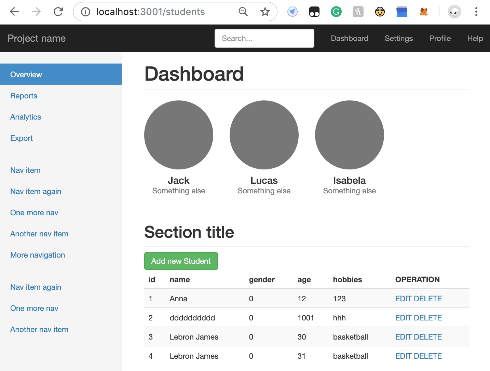
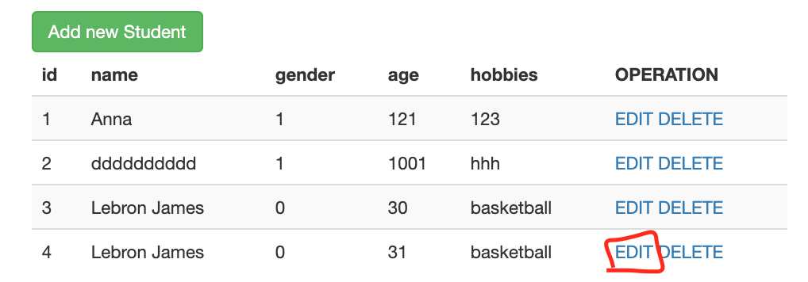
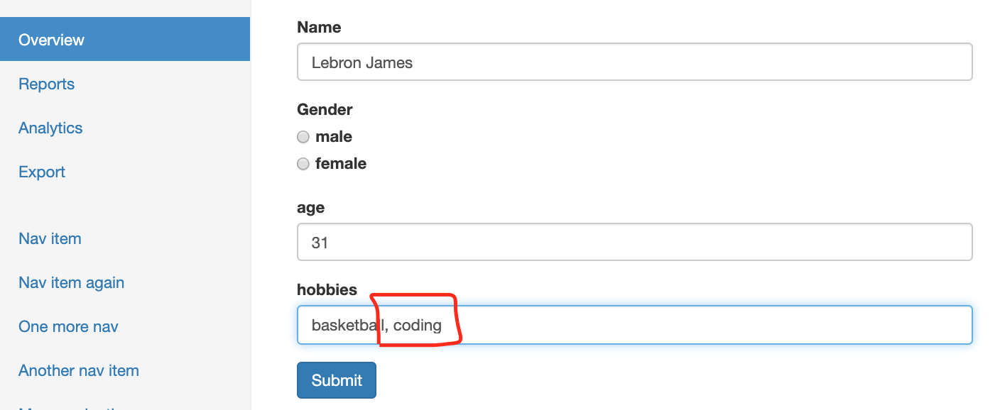
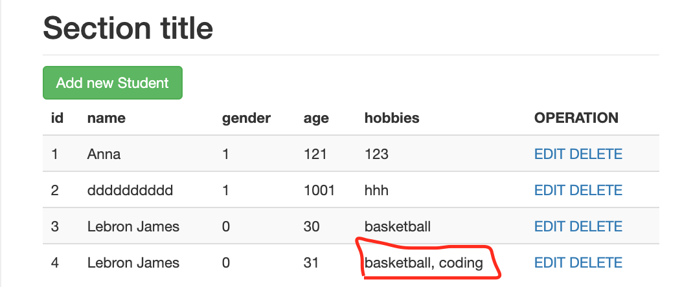

### Introduction

Implement CRUD functions for "<u>**Student**</u>" (name,gender,age,hobbies).


### Tools to use (NPM packages):

- **Express** (a minimal and flexible Node.js web application framework)
- **nodemon** (simple monitor script for use during development of a node.js app.)
- **art-template** (a javascript templating engine)
- **mongoose** (a [MongoDB](https://www.mongodb.org/) object modeling tool designed to work in an asynchronous environment.)
- **body-parser** (Parse incoming request bodies in a middleware before your handlers, available under the `req.body` property.)


### Steps

1. #### Start a server and listens on port <u>**3001**</u> for connections

```js
const express = require('express')
const app=express()
const port=3001

app.get('/',(req,res)=>res.send('Hello Node.js!'))

app.listen(port,()=>console.log(`App listening on port ${port}!`))

```

2. #### Importing resources downloaded from internet (html,css,js,img)

- <u>public</u>

  - css
  - img
  - js

- <u>views</u>

  - index.html
  - edit.html
  - new.html

  

3. #### Create 'Router' — using express.Router 

   ```js
   const express=require('express')
   let router=express.Router()
   
   router.get('/students',(req,res)=>{
       res.render('index.html',{
           labels:[
               'Jack',
               'Lucas',
               'Isabela'
           ]
       })
   })
   
   module.exports=router
   ```

   when url = '<http://localhost:3001/students>', server-side render 'index.html'

   

   *Note: I use <u>**express-art-template**</u> as a template engine to render pages*

   ```js
   //javascript template engine ---'art-template'
   app.engine('html',require('express-art-template'))
   ```

   

   **output:**

   

   

4. #### Create Schema for "Student" — using 'mongoose'

   Student (name,gender,age,hobbies)

   ```js
   let mongoose=require('mongoose')
   mongoose.connect('mongodb://localhost:27017/student')
   let Schema=mongoose.Schema;
   
   let studentSchema=new Schema({
       name:{
           type:String,
           required:true
       },
       gender:{
           type:Number,
           default:0,
           enum:[0,1]
       },
       age:{
           type:Number
       },
       hobbies:{
           type:String
       }
   })
   
   module.exports=mongoose.model('Student',studentSchema)
   ```

   

   *<u>Node.js debugging in VS code</u>*

   ```json
   //Add this to launch.json
   {
               "type": "node",
               "request": "attach",
               "name": "Attach by Process ID",
               "processId": "${command:PickProcess}"
           },
   ```

5. #### 'C'---Create a student

   ```js
   //post request of adding new student
   router.post('/students/new',(req,res)=>{
     
       new Student(req.body).save((err)=>{
           //using body-parser, req.body is an object containing values
           if(err)console.log(err)
           res.redirect('/students')
       })
   })
   ```

   demo:
   

6. #### 'R'---Read students from MongoDB

   ```js
   Student.find((err,students)=>{
           res.render('index.html',{
               labels:[
                   ...
               ],
               students:students
           })
   
       })
   ```

   demo:

   


7. #### 'U'---Update student

   **get student info by ID, and render it in edit.html**

   ```js
   router.get('/students/edit',(req,res)=>{
       Student.findById(req.query.id,(err,editStudent)=>{
           if(err) console.log(err)
           res.render('edit.html',{
               editStudent:editStudent
           })
       })
   })
   ```

   

   

   **post request and update info of student**

   ```js
   router.post('/students/edit',(req,res)=>{
       Student.findByIdAndUpdate(req.body.id,req.body,(err,ret)=>{
           if(err) console.log(err)
           res.redirect('/students/')
       })
   })
   ```

   



